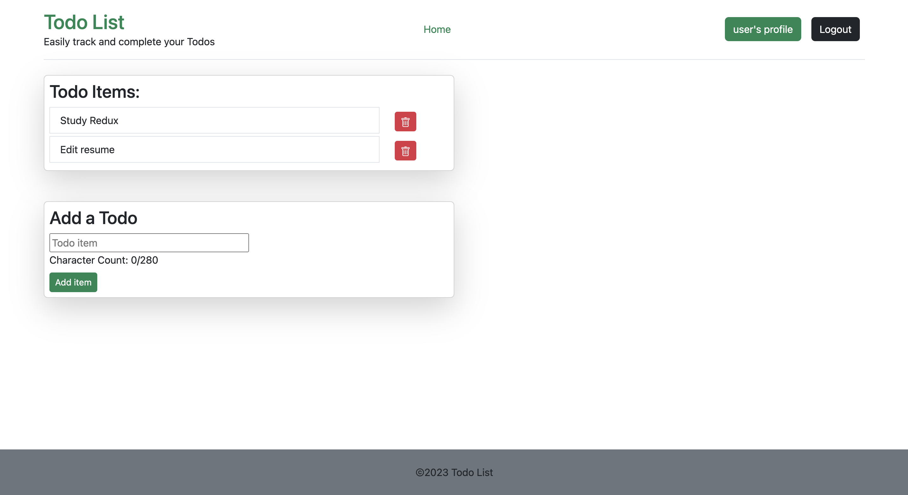

# React Todo List

## Description

This is a simple todo list application built with the MERN stack. It allows users to add and delete tasks. In the future it will also allows users to mark tasks as complete. It utilizes authorization and authentication to allow users to create accounts and login. It also utilizes a database to store user information and tasks. 

### What I Learned
How to update state using React
Apollo Client mutations
How to use GraphQL to query and mutate data
How to use React Router to navigate between pages

### Technologies Used
Node.js, Express.js, MongoDB, Mongoose, React.js, React Router, React Bootstrap, Bcrypt, JSON Web Token, GraphQL, Apollo-Client and Heroku.

## Installation

To install, clone the repository and run `npm install` in the root directory. Then run `npm run develop` to start the application.

## Usage

To use, simply navigate to the url: https://lit-shelf-24930-ebdbb7362bdc.herokuapp.com/ and click either signup or login. Once logged in, navigate to your profile in the header you can add tasks by typing in the input field and clicking the add button. You can delete tasks by clicking the delete button next to the task.

## License

MIT License